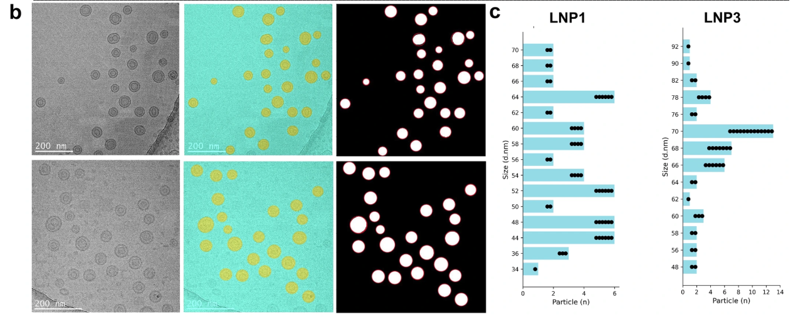
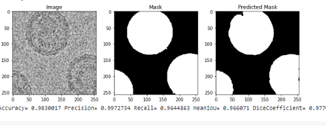
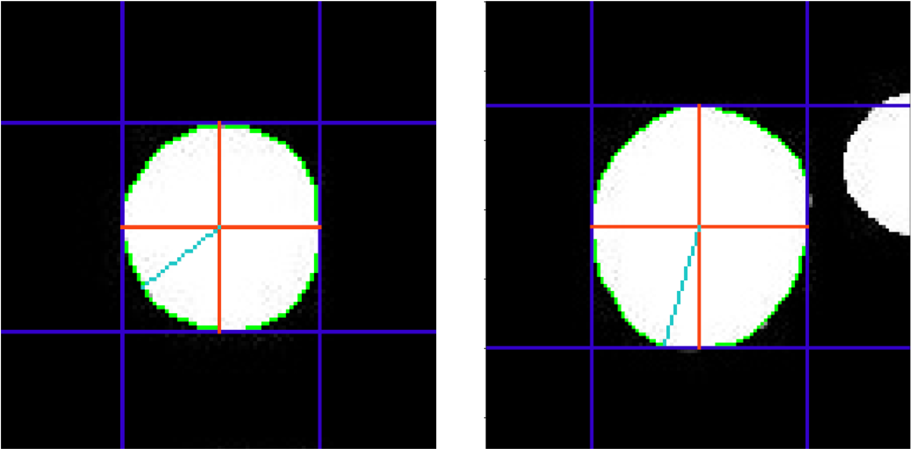

# 🧪 Semantic Segmentation of LNPs from (Cryo-TEM) images using Self-supervised learning techniques and automatic LNPs size distribution quantification
Paper link: https://www.nature.com/articles/s42003-024-06589-5


---
## 📊 Results

### 🔹 Size Distribution Output



### 🔹 Segmentation Output


### 🔹 Homogeniety Analysis

---

### 🔹 Segmentation Performance Comparison
| Model       | Training Type        | mIoU (%) |
|------------|---------------------|----------|
| U-Net      | Supervised          | 86.03    |
| BT-UNet    | Self-supervised (20%) | 80.17    |
| BT-UNet    | Self-supervised (50%) | **91.07** |

---


---


## 📌 Overview
This project focuses on **automating the size distribution analysis of Lipid Nanoparticles (LNPs)** from Cryogenic Transmission Electron Microscopy (Cryo-TEM) images using **deep learning and image processing techniques**.

LNP size plays a critical role in:
- Drug encapsulation efficiency  
- Biodistribution  
- Cellular uptake  

Manual measurement is time-consuming and error-prone. This work provides an **end-to-end automated pipeline** for segmentation and quantitative analysis.

---

## 💡 Key Contributions
- 🔬 Automated **semantic segmentation of LNPs**
- 🤖 Comparison of:
  - **U-Net (supervised learning)**
  - **BT-UNet (self-supervised learning)**
- 📈 Achieved **91.07% mIoU** using self-supervised learning with limited labeled data  
- ⚙️ Automated **particle size extraction** from segmented images  
- 📊 Generated **size distribution histograms**
- 🧪 Performed **homogeneity analysis** using statistical methods  

---

## 🧠 Methodology

### 1. Semantic Segmentation
- U-Net: Fully supervised baseline  
- BT-UNet: Self-supervised pretraining + fine-tuning  
- Self-supervised learning improves performance when labeled data is limited  

### 2. Particle Detection & Size Estimation
- Watershed algorithm to separate overlapping particles  
- Contour detection from segmentation masks  
- Minimum enclosing circle used to estimate particle radius  

### 3. Size Distribution & Analysis
- Histogram-based size distribution  
- Chi-square goodness-of-fit test for:
  - Shape consistency  
  - Particle homogeneity  

---


## 📂 Code Structure

```bash id="3cgm7x"
├── image_processing_bt_unet.py        # Segmentation + particle detection pipeline
├── lnps_size_distribution_homogeneity.py  # Size distribution + statistical analysis
├── images/
│   ├── segmented_output.png
│   ├── size_distribution.png
│   └── comparison_results.png
└── README.md
